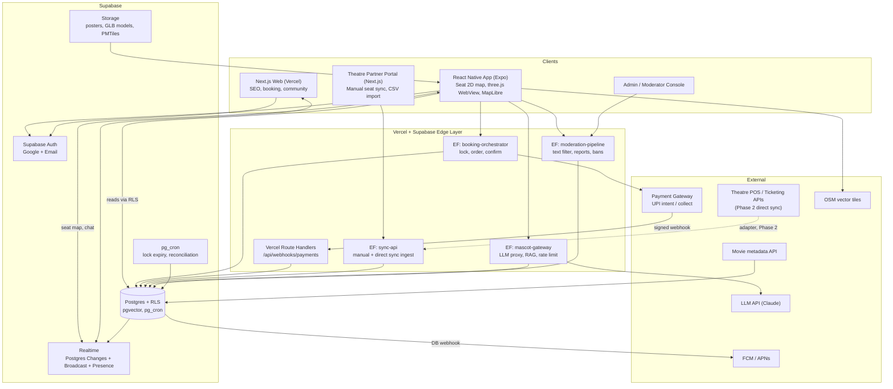
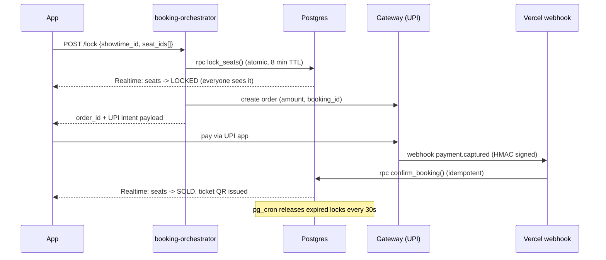

# Mindstor AI Cinephile Ticketing: System Architecture

## 0. Key decisions

| Area | Choice | Why |
|---|---|---|
| Backend | **Supabase** (Postgres + Realtime + Auth + Edge Functions + Storage) | Seat inventory, bookings and payments are relational and need transactions, constraints and row locks. Firestore handles this badly. Realtime covers chat and seat-map updates. |
| Mobile | **React Native (Expo)** | Shares TypeScript and three.js code with the Next.js web app and the theatre portal. Flutter would force a second 3D codebase. |
| 3D seat view | three.js in a shared `packages/seat-viewer`, rendered in a WebView on mobile and natively on web | One implementation everywhere. Load a low-poly GLB per screen. |
| Maps | MapLibre GL (`@maplibre/maplibre-react-native`) with OSM data | OSM's public tile servers prohibit heavy app traffic. Use Protomaps/PMTiles on Supabase Storage or Cloudflare R2, or a paid OSM tile host. |
| Web / serverless | Next.js on Vercel: marketing site, SEO movie pages, **Theatre Partner Portal**, payment webhooks | |
| Auth | Supabase Auth: Google OAuth + email magic link or password. SMS provider disabled. | No SMS OTP cost. |
| Payments | Razorpay or Cashfree: UPI intent and collect as default, cards and netbanking as fallback | Server-side order creation, signed webhook as the source of truth. |
| AI mascot | Edge Function proxy to an LLM (Claude API), with a per-user rate limit and retrieval over movie and screen data (pgvector) | Keys never reach the client. |

**Core principle:** the database is the single source of truth for seat state. Every inventory source, whether direct API sync or manual, writes through the same RPC functions.

## 1. Architecture diagram



### Booking flow (seat lock, pay, confirm)



## 2. Database schema (Supabase / Postgres)

```sql
create extension if not exists "pgcrypto";
create extension if not exists vector;
create extension if not exists pg_cron;
create extension if not exists postgis;

-- ENUMS
create type user_role      as enum ('user','moderator','theatre_manager','admin');
create type seat_status    as enum ('available','locked','sold','blocked','offline_sold');
create type booking_status as enum ('pending','confirmed','cancelled','expired','refunded');
create type payment_status as enum ('created','captured','failed','refunded');
create type inventory_mode as enum ('manual','direct_api');
create type sync_source    as enum ('app','manual_portal','csv','direct_api');
create type spec_verification as enum ('unverified','theatre_claimed','mindstor_verified');

-- USERS
create table profiles (
  id uuid primary key references auth.users(id) on delete cascade,
  display_name text not null,
  avatar_url text,
  role user_role not null default 'user',
  home_city text,
  favorite_formats text[] default '{}',          -- e.g. {'IMAX','Dolby Cinema'}
  chat_banned_until timestamptz,
  created_at timestamptz default now()
);

-- THEATRES / SCREENS
create table theatres (
  id uuid primary key default gen_random_uuid(),
  name text not null,
  chain text,
  city text not null,
  address text,
  geo geography(point,4326) not null,
  inventory_mode inventory_mode not null default 'manual',
  sync_api_config jsonb,                          -- encrypted ref for Phase 2 adapters
  owner_org_id uuid,
  is_active boolean default true
);
create index on theatres using gist(geo);

create table theatre_staff (
  theatre_id uuid references theatres on delete cascade,
  user_id uuid references profiles on delete cascade,
  primary key (theatre_id, user_id)
);

create table projector_models (
  id uuid primary key default gen_random_uuid(),
  brand text not null,                            -- Christie, Barco, NEC
  model text not null,                            -- e.g. 'CP4325-RGB'
  technology text,                                -- Xenon, RGB Laser, Laser Phosphor
  max_brightness_lumens int,
  native_resolution text,                         -- 2K, 4K
  unique (brand, model)
);

create table audio_systems (
  id uuid primary key default gen_random_uuid(),
  name text unique not null,                      -- Dolby Atmos, DTS:X, Barco AuroMax
  max_channels int
);

create table screens (
  id uuid primary key default gen_random_uuid(),
  theatre_id uuid not null references theatres on delete cascade,
  name text not null,
  format text,                                    -- IMAX, 4DX, Standard, Dolby Cinema
  capacity int not null,
  layout_version int not null default 1,
  model_3d_url text,                              -- GLB in Storage
  unique (theatre_id, name)
);

-- verified, comparable specs (1:1 with screens)
create table screen_specs (
  screen_id uuid primary key references screens on delete cascade,
  projector_model_id uuid references projector_models,
  audio_system_id uuid references audio_systems,
  screen_width_m numeric(5,2),
  screen_height_m numeric(5,2),
  aspect_ratio text,                              -- 1.43:1, 1.90:1, 2.39:1
  screen_gain numeric(3,2),
  is_curved boolean default false,
  max_resolution text,
  frame_rate_max int,
  hdr_support text,                               -- none, HDR10, Dolby Vision
  speaker_count int,
  seat_type text,                                 -- recliner, standard
  verification spec_verification default 'unverified',
  verified_by uuid references profiles,
  verified_at timestamptz,
  evidence_urls text[] default '{}',
  updated_at timestamptz default now()
);

-- Comparison logic: normalized score view
create view screen_comparison as
select s.id as screen_id, t.name as theatre, s.name as screen, s.format,
  sp.screen_width_m, sp.screen_height_m,
  round(sp.screen_width_m*sp.screen_height_m,1) as screen_area_m2,
  pm.brand, pm.model, pm.technology, pm.max_brightness_lumens,
  sp.max_resolution, a.name as audio, sp.verification,
  (coalesce(sp.screen_width_m*sp.screen_height_m,0)/2
   + (case pm.technology when 'RGB Laser' then 30 when 'Laser Phosphor' then 22 else 10 end)
   + (case when a.name ilike '%Atmos%' then 15 else 5 end)
   + (case sp.verification when 'mindstor_verified' then 5 else 0 end)) as quality_score
from screens s
join theatres t on t.id=s.theatre_id
left join screen_specs sp on sp.screen_id=s.id
left join projector_models pm on pm.id=sp.projector_model_id
left join audio_systems a on a.id=sp.audio_system_id;
-- App calls: select * from screen_comparison where screen_id = any($1) -> renders side-by-side

-- SEATS (static layout)
create table seats (
  id uuid primary key default gen_random_uuid(),
  screen_id uuid not null references screens on delete cascade,
  row_label text not null,
  seat_number int not null,
  tier text default 'standard',                   -- standard, premium, recliner
  x numeric, y numeric, z numeric,                -- for 2D map and three.js
  is_accessible boolean default false,
  unique (screen_id, row_label, seat_number)
);

-- MOVIES / SHOWTIMES
create table movies (
  id uuid primary key default gen_random_uuid(),
  tmdb_id int unique,
  title text not null,
  synopsis text,
  language text, runtime_min int,
  certificate text,                               -- U, UA, A
  genres text[], director text, cast_members text[],
  poster_url text, trailer_url text,
  release_date date,
  embedding vector(1536)                          -- mascot recommendations
);

create table showtimes (
  id uuid primary key default gen_random_uuid(),
  movie_id uuid not null references movies,
  screen_id uuid not null references screens,
  starts_at timestamptz not null,
  ends_at timestamptz not null,
  language text, format text, subtitle text,
  base_price_paise int not null,
  tier_prices jsonb default '{}',
  convenience_fee_paise int default 0,            -- the low-fee differentiator
  status text default 'scheduled',
  unique (screen_id, starts_at)
);
create index on showtimes (movie_id, starts_at);

-- PER-SHOW SEAT INVENTORY (source of truth for availability)
create table showtime_seats (
  showtime_id uuid references showtimes on delete cascade,
  seat_id uuid references seats,
  status seat_status not null default 'available',
  locked_by uuid references profiles,
  locked_until timestamptz,
  booking_id uuid,
  price_paise int not null,
  source sync_source default 'app',
  version bigint not null default 0,              -- optimistic concurrency for sync
  updated_at timestamptz default now(),
  primary key (showtime_id, seat_id)
);
create index on showtime_seats (showtime_id, status);
create index on showtime_seats (locked_until) where status='locked';

-- BOOKINGS / TICKETS / PAYMENTS
create table bookings (
  id uuid primary key default gen_random_uuid(),
  user_id uuid not null references profiles,
  showtime_id uuid not null references showtimes,
  status booking_status not null default 'pending',
  subtotal_paise int not null,
  fee_paise int not null default 0,
  total_paise int generated always as (subtotal_paise + fee_paise) stored,
  expires_at timestamptz not null,
  created_at timestamptz default now()
);

create table tickets (
  id uuid primary key default gen_random_uuid(),
  booking_id uuid not null references bookings on delete cascade,
  showtime_id uuid not null,
  seat_id uuid not null,
  qr_token text unique not null,                  -- signed, rotating JWT
  checked_in_at timestamptz,
  unique (showtime_id, seat_id)                   -- hard guard against double-sell
);

create table payments (
  id uuid primary key default gen_random_uuid(),
  booking_id uuid not null references bookings,
  gateway text not null,
  gateway_order_id text unique,
  gateway_payment_id text unique,                 -- idempotency key for webhooks
  method text default 'upi',
  amount_paise int not null,
  status payment_status default 'created',
  raw_webhook jsonb,
  created_at timestamptz default now()
);

-- CHAT + MODERATION
create table chat_rooms (
  id uuid primary key default gen_random_uuid(),
  slug text unique not null,                      -- 'global','city-kochi','movie-<id>'
  kind text not null,                             -- global | city | movie | genre
  movie_id uuid references movies,
  is_slow_mode boolean default false,
  slow_mode_seconds int default 0,
  is_locked boolean default false
);

create table chat_messages (
  id bigint generated always as identity primary key,
  room_id uuid not null references chat_rooms on delete cascade,
  user_id uuid not null references profiles,
  body text not null check (char_length(body) between 1 and 1000),
  reply_to bigint references chat_messages,
  spoiler boolean default false,
  is_deleted boolean default false,
  deleted_by uuid references profiles,
  created_at timestamptz default now()
);
create index on chat_messages (room_id, created_at desc);

create table chat_reports (
  id uuid primary key default gen_random_uuid(),
  message_id bigint references chat_messages,
  reporter_id uuid references profiles,
  reason text, status text default 'open',
  resolved_by uuid references profiles, created_at timestamptz default now()
);

create table moderation_actions (
  id uuid primary key default gen_random_uuid(),
  target_user_id uuid references profiles,
  moderator_id uuid references profiles,
  action text not null,                           -- warn | mute | ban | delete_msg
  reason text, expires_at timestamptz, created_at timestamptz default now()
);

-- ATOMIC SEAT LOCK (never lock from the client)
create or replace function lock_seats(p_showtime uuid, p_seats uuid[], p_user uuid, p_ttl interval default '8 minutes')
returns setof showtime_seats language plpgsql security definer as $$
declare n int;
begin
  perform 1 from showtime_seats
   where showtime_id=p_showtime and seat_id=any(p_seats)
   order by seat_id for update;                   -- deterministic order avoids deadlocks

  update showtime_seats set status='locked', locked_by=p_user,
         locked_until=now()+p_ttl, version=version+1, updated_at=now()
   where showtime_id=p_showtime and seat_id=any(p_seats)
     and (status='available' or (status='locked' and locked_until<now()));
  get diagnostics n = row_count;
  if n <> array_length(p_seats,1) then
    raise exception 'SEATS_UNAVAILABLE' using errcode='P0001';  -- rolls back partial lock
  end if;
  return query select * from showtime_seats where showtime_id=p_showtime and seat_id=any(p_seats);
end $$;

-- Lock expiry sweep
select cron.schedule('release-locks','30 seconds',
 $$update showtime_seats set status='available', locked_by=null, locked_until=null, version=version+1
   where status='locked' and locked_until<now()$$);

-- RLS (essentials)
alter table profiles enable row level security;
alter table chat_messages enable row level security;
alter table bookings enable row level security;
alter table showtime_seats enable row level security;

create policy "profiles readable" on profiles for select using (true);
create policy "own profile update" on profiles for update using (auth.uid()=id);
create policy "chat read" on chat_messages for select using (not is_deleted);
create policy "chat insert" on chat_messages for insert with check (
  auth.uid()=user_id and not exists
  (select 1 from profiles p where p.id=auth.uid() and p.chat_banned_until>now()));
create policy "own bookings" on bookings for select using (auth.uid()=user_id);
create policy "seat map public read" on showtime_seats for select using (true);
-- all seat/booking writes go through security-definer RPCs or service role only
```

**Realtime usage:** `showtime_seats` via Postgres Changes, filtered by `showtime_id`. For hot shows, prefer Broadcast triggered from the RPC. Chat uses Postgres Changes on `chat_messages` plus Presence for online counts. Past roughly 5k concurrent users in one room, switch the global room to Broadcast with async persistence.

**Chat moderation layers:**
1. Client-side slow mode and rate limits.
2. `moderation-pipeline` Edge Function with a profanity and toxicity filter (LLM or classifier) via a DB webhook, which soft-deletes and logs.
3. Report queue for moderators.
4. Mute and ban through `moderation_actions`, which sets `chat_banned_until`.

## 3. Manual seat sync fallback API (MVP)

Base: `https://<project>.supabase.co/functions/v1/sync-api/v1`

**Auth:** a Supabase JWT with the `theatre_manager` role. The manager must be in `theatre_staff`, enforced in the function. Phase 2 direct sync adds `X-Mindstor-Key` plus `X-Signature: HMAC-SHA256(body)`, with the same endpoints. All writes require an `Idempotency-Key` header.

**Rules:**
- Writes call `apply_seat_changes()`, which uses the `version` column for optimistic concurrency.
- Live app locks win over manual `available` writes.
- Every call is logged to a `sync_events` audit table.

| Method | Endpoint | Purpose |
|---|---|---|
| GET | `/theatres/{tid}/showtimes?date=YYYY-MM-DD` | List the day's shows with seat counts |
| GET | `/showtimes/{sid}/seats` | Full seat state including `version` |
| POST | `/showtimes/{sid}/seats/bulk` | Apply a batch of seat state changes |
| POST | `/showtimes/{sid}/offline-sales` | Record counter and walk-in sales (`offline_sold`) |
| POST | `/showtimes/{sid}/block` | Block seats (maintenance, comp, house seats) |
| POST | `/showtimes/{sid}/release` | Release blocked seats |
| PUT | `/showtimes/{sid}/snapshot` | Replace inventory with the theatre's end-of-day truth (diff returned) |
| POST | `/theatres/{tid}/import/csv` | Upload a showtime or seat CSV (multipart, dry-run supported) |
| POST | `/theatres/{tid}/heartbeat` | Manager portal liveness, used for stale-data warnings |
| GET | `/theatres/{tid}/reconciliation?date=` | Mindstor sales vs. theatre-reported sales |

### Examples

`POST /showtimes/{sid}/seats/bulk`
```json
// Headers: Authorization: Bearer <jwt>, Idempotency-Key: 7c1e...
{
  "source": "manual_portal",
  "changes": [
    { "seat": "F12", "status": "offline_sold", "expected_version": 4 },
    { "seat": "F13", "status": "offline_sold", "expected_version": 2 },
    { "seat": "A1",  "status": "blocked", "reason": "projector obstruction" }
  ]
}
```
```json
// 200 (207 if partial)
{
  "applied": 2,
  "conflicts": [
    { "seat": "F13", "reason": "LOCKED_BY_APP", "current_status": "locked", "current_version": 3 }
  ],
  "rejected": [],
  "sync_event_id": "evt_01J..."
}
```

`POST /showtimes/{sid}/offline-sales`
```json
{ "seats": ["G5","G6"], "sold_at": "2026-10-04T18:42:00+05:30", "counter_ref": "POS-88231" }
```

`PUT /showtimes/{sid}/snapshot`
```json
{ "source": "manual_portal",
  "sold_seats": ["F12","F13","G5","G6"], "blocked_seats": ["A1"] }
```
Response includes `diff: { newly_marked, released, conflicts_with_online_bookings }`. The last field is a priority alert: any seat sold online and also marked sold offline needs a manual resolution.

**Errors:** `400 VALIDATION`, `401`, `403 NOT_THEATRE_STAFF`, `404`, `409 VERSION_CONFLICT / LOCKED_BY_APP / DUPLICATE_BOOKING`, `422 SHOW_STARTED`, `429`.

**MVP operating model:**
1. Theatre staff open the portal on a tablet at the box office. The seat map shows the live state.
2. They mark counter sales as they happen, or upload a snapshot every N minutes.
3. A "last synced" badge appears in the app. If sync is stale for more than 15 minutes, a warning is shown and online sales for that show stop.
4. Daily reconciliation and settlement report.

**Phase 2 direct API:** write a `TheatreAdapter` interface (`fetchSeats`, `pushHold`, `confirmSale`, `release`). Each theatre system gets one adapter, selected by `theatres.inventory_mode`. The booking-orchestrator calls the adapter before confirming so the seat is held upstream too.

## 4. Monorepo structure (pnpm + Turborepo)

```
mindstor/
├── apps/
│   ├── mobile/                      # Expo React Native
│   │   ├── app/                     # expo-router: (tabs)/home, movie/[id], book/[showtimeId], chat, mascot, profile
│   │   ├── src/features/            # booking, screens-compare, chat, mascot, map, tickets
│   │   ├── src/lib/                 # supabase client, query client (TanStack), analytics
│   │   └── app.config.ts
│   ├── web/                         # Next.js (Vercel): public site, booking, community
│   │   ├── app/
│   │   └── app/api/webhooks/payments/route.ts   # signed gateway webhook
│   ├── partner-portal/              # Next.js: theatre manual sync UI, CSV import, reports
│   └── admin/                       # Next.js: moderation, spec verification, content
├── packages/
│   ├── ui/                          # shared design tokens + RN/web components
│   ├── seat-viewer/                 # three.js: SeatScene, loaders, picking, WebView bridge
│   ├── api-client/                  # typed SDK wrapping Supabase + Edge Functions
│   ├── db-types/                    # generated: supabase gen types typescript
│   ├── schemas/                     # Zod schemas shared by client + Edge Functions
│   ├── screen-compare/              # comparison and scoring logic (pure TS, unit tested)
│   ├── theatre-adapters/            # TheatreAdapter interface, manual + (future) vendor adapters
│   └── config/                      # eslint, tsconfig, prettier presets
├── supabase/
│   ├── migrations/                  # 0001_init.sql, 0002_rls.sql, 0003_rpc.sql, ...
│   ├── functions/
│   │   ├── booking-orchestrator/
│   │   ├── sync-api/
│   │   ├── mascot-gateway/
│   │   ├── moderation-pipeline/
│   │   └── _shared/                 # auth, idempotency, errors, logger
│   ├── seed/                        # projector_models, audio_systems, demo theatres
│   ├── tests/                       # pgTAP: RLS, lock_seats concurrency
│   └── config.toml
├── tools/
│   ├── seat-layout-importer/        # CSV/JSON -> seats + GLB generator
│   └── scripts/                     # tmdb-sync, load-test (k6) for seat locking
├── .github/workflows/               # ci.yml (lint, test, typecheck), eas-build.yml, supabase-deploy.yml
├── docs/                            # ADRs, runbooks, this document
├── turbo.json
├── pnpm-workspace.yaml
└── package.json
```

**Build order for the team:**
1. `supabase/migrations` and `db-types`, then `lock_seats` with a concurrency test (100 parallel lockers on one seat, exactly one wins).
2. `sync-api` plus the partner portal. Inventory exists before consumers do.
3. Mobile booking flow, 2D seat map first, then payments sandbox end to end.
4. `screen-compare` and the spec admin workflow.
5. three.js seat-view as an enhancement on the 2D picker.
6. Chat and moderation.
7. Mascot, once there is enough movie data for retrieval.

## 5. Risks and mitigations

- **Double selling (manual sync):** the `unique (showtime_id, seat_id)` constraint on `tickets`, a stale-sync cutoff, and daily reconciliation.
- **Payment drift:** webhooks are idempotent on `gateway_payment_id`. A cron job polls the gateway for `pending` bookings older than 10 minutes.
- **Seat-map load spikes:** subscribe only to the active `showtime_id`, use Broadcast for hot shows, and add Supabase compute add-ons before launches.
- **UPI on mobile:** use intent flows for GPay, PhonePe and Paytm, and handle the app-resume-after-pay race by polling booking status.
- **Spec credibility:** show a verification badge, and only `mindstor_verified` specs count in comparison scoring and filters. Keep evidence URLs.
- **AI cost and abuse:** rate-limit per user, cap tokens, and ground answers in your own tables to limit hallucinated showtimes. The mascot never quotes prices or availability from the model.
- **Chat abuse:** layered moderation (section 2), plus a trust level for new accounts (for example, no links for 24 hours).
- **OSM tiles:** self-host or buy tiles, and attribute OpenStreetMap contributors in the app.
